# Email Marketing System - Complete Architecture

```mermaid
graph TB
    subgraph "User Entry Points"
        A1[Website Newsletter<br/>subscribe.html]
        A2[Book Landing Page<br/>the-necessary-evil-book.html]
        A3[Live Event Page<br/>live-event.html]
        A4[PayPal Purchase<br/>onApprove callback]
        A5[Campaign Manager<br/>Manual Enroll]
    end

    subgraph "Subscription Handler Lambda"
        B[email-subscription-handler<br/>Lambda Function]
        B1[handle_subscription]
        B2[handle_confirmation]
        B3[bridge_to_email_marketing]
        B4[bridge_website_subscriber]
        B5[enroll_post_purchase]
        B6[trigger_drip_now]
    end

    subgraph "DynamoDB Tables - Legacy"
        C1[(email-subscribers<br/>PK: email)]
        C2[(book-subscribers<br/>PK: email)]
        C3[(email-events<br/>PK: event_id)]
    end

    subgraph "DynamoDB Tables - Multi-Tenant"
        D1[(user-email-subscribers<br/>PK: user_id, SK: subscriber_email)]
        D2[(user-email-campaigns<br/>PK: user_id, SK: campaign_id)]
        D3[(user-email-drip-enrollments<br/>PK: user_id, SK: enrollment_id)]
        D4[(user-email-events<br/>PK: user_id, SK: event_id)]
    end

    subgraph "Campaign Groups"
        E1[pre-purchase-book-sequence<br/>7 emails]
        E2[post-purchase-sequence<br/>7 emails]
        E3[election-map-transition-sequence<br/>7 emails]
        E4[general-newsletter-sequence<br/>7 emails]
    end

    subgraph "Email Processing"
        F1[EventBridge<br/>Daily Trigger]
        F2[email-drip-processor<br/>Lambda]
        F3[SQS Queue<br/>email-sending-queue]
        F4[email-sender<br/>Lambda]
    end

    subgraph "Email Delivery & Tracking"
        G1[Amazon SES<br/>Send Email]
        G2[Email with<br/>Open Pixel & Click Links]
        G3[User Opens Email]
        G4[User Clicks Link]
    end

    subgraph "Tracking Pipeline"
        H1[CloudFront<br/>E3N00R2D2NE9C5]
        H2[API Gateway<br/>niexv1rw75]
        H3["track/open/base64"]
        H4["track/click/base64"]
        H5[Return 1x1 Pixel]
        H6[302 Redirect to URL]
    end

    subgraph "Analytics & Management"
        I1[Campaign Manager<br/>campaign-manager.html]
        I2[Advanced Analytics<br/>advanced-email-analytics.html]
        I3[user-email-api<br/>Lambda]
    end

    %% Entry Point Flows
    A1 -->|POST /subscribe<br/>source: website_subscribe| B1
    A2 -->|POST /subscribe<br/>list_type: book| B1
    A3 -->|POST /subscribe<br/>source: live_event_signup| B1
    A4 -->|POST enroll_post_purchase| B5
    A5 -->|POST trigger_drip_now| B6

    %% Subscription Handler Logic
    B1 -->|Website signup<br/>status: pending| C1
    B1 -->|Book signup<br/>status: active| C2
    B1 -->|Send confirmation email| G1
    
    %% Confirmation Flow
    A1 -.->|User clicks confirm link| B2
    B2 -->|Update status: active| C1
    B2 -->|Bridge to MT system| B4
    B2 -->|Send welcome email| G1

    %% Bridging to Multi-Tenant System
    B1 -->|Book signup| B3
    B2 -->|Website confirm| B4
    B3 -->|Create subscriber| D1
    B3 -->|Enroll in pre-purchase| D3
    B4 -->|Create subscriber| D1
    B4 -->|Enroll in general-newsletter| D3
    B5 -->|Create subscriber| D1
    B5 -->|Enroll in post-purchase| D3

    %% Campaign Management
    D2 -.->|Contains| E1
    D2 -.->|Contains| E2
    D2 -.->|Contains| E3
    D2 -.->|Contains| E4

    %% Drip Processing Flow
    F1 -->|Trigger daily<br/>9 AM UTC| F2
    F2 -->|Query active enrollments| D3
    F2 -->|Check campaign_group| D2
    F2 -->|Calculate due date<br/>delay_days + delay_hours| F2
    F2 -->|If due, send to SQS| F3
    F2 -->|Update enrollment<br/>current_sequence_number<br/>last_sent_at| D3

    %% Manual Trigger
    B6 -->|Bypass delay<br/>Send immediately| F3

    %% Email Sending Flow
    F3 -->|Poll messages| F4
    F4 -->|Get campaign content| D2
    F4 -->|Get subscriber info| D1
    F4 -->|Inject tracking pixel<br/>Rewrite all links| F4
    F4 -->|Send via SES| G1
    F4 -->|Log sent event| D4

    %% Email Delivery
    G1 -->|Deliver email| G2
    G2 -->|User receives| G3
    G2 -->|User receives| G4

    %% Open Tracking
    G3 -->|Load pixel image| H1
    H1 -->|"Route /track/open/*"| H2
    H2 -->|Invoke Lambda| B
    B -->|"Decode base64<br/>email:campaign_id"| H3
    H3 -->|Log open event| D4
    H3 -->|Return pixel| H5

    %% Click Tracking
    G4 -->|Click tracked link| H1
    H1 -->|"Route /track/click/*"| H2
    H2 -->|Invoke Lambda| B
    B -->|"Decode base64<br/>email:campaign_id:url"| H4
    H4 -->|Log click event| D4
    H4 -->|Redirect to destination| H6

    %% Analytics & Management
    I1 -->|GET /subscribe?action=list_campaigns| B
    I1 -->|GET /subscribe?action=list_drip_enrollments| B
    I1 -->|POST create_campaign| B
    I1 -->|POST update_campaign| B
    I1 -->|POST trigger_drip_now| B6
    B -->|Read/Write| D2
    B -->|Read/Write| D3

    I2 -->|GET /user-email?action=get_recent_events_public| I3
    I3 -->|Query all events<br/>Sort by timestamp| D4
    I3 -->|Also read legacy| C3
    I2 -->|Display analytics| I2

    style A1 fill:#e1f5ff
    style A2 fill:#e1f5ff
    style A3 fill:#e1f5ff
    style A4 fill:#e1f5ff
    style A5 fill:#e1f5ff
    style B fill:#fff3cd
    style F2 fill:#fff3cd
    style F4 fill:#fff3cd
    style I3 fill:#fff3cd
    style D1 fill:#d1fae5
    style D2 fill:#d1fae5
    style D3 fill:#d1fae5
    style D4 fill:#d1fae5
    style G1 fill:#fee2e2
    style H1 fill:#fce7f3
```



## System Components

### 1. Entry Points
- **Website Newsletter** (`subscribe.html`) - General newsletter signups with confirmation flow
- **Book Landing Page** - Free AI Survival Kit signups (no confirmation)
- **Live Event Page** - Event registration (no confirmation)
- **PayPal Purchase** - Auto-enrollment after book purchase
- **Campaign Manager** - Manual enrollment by admin

### 2. Subscription Handler Lambda
**Function:** `email-subscription-handler`
- Handles all subscription requests
- Manages confirmation flow for website signups
- Bridges legacy tables to multi-tenant system
- Enrolls users in appropriate campaign groups
- Provides manual trigger for drip emails

### 3. Database Tables

#### Legacy Tables (Still Used)
- `email-subscribers` - Election list subscribers (with confirmation)
- `book-subscribers` - Book survival kit subscribers
- `email-events` - Historical event data

#### Multi-Tenant Tables (Primary)
- `user-email-subscribers` - All subscribers with tags
- `user-email-campaigns` - Campaign definitions with html_content
- `user-email-drip-enrollments` - Active/completed enrollments
- `user-email-events` - All tracking events (opens, clicks, sent)

### 4. Campaign Groups
Each group contains 7 emails with sequence_number and delay_days:

1. **pre-purchase-book-sequence** - For survival kit signups
2. **post-purchase-sequence** - For book buyers
3. **election-map-transition-sequence** - For election map users
4. **general-newsletter-sequence** - For website subscribers (NEW)
   - Includes 2 book promotion emails (#6 and #7)

### 5. Email Processing Pipeline

#### Daily Drip Processor
- **Trigger:** EventBridge (daily at 9 AM UTC)
- **Function:** `email-drip-processor`
- **Logic:**
  1. Query all active enrollments
  2. For each enrollment, find next campaign by sequence_number
  3. Calculate due date based on delay_days/delay_hours
  4. If due, send message to SQS
  5. Update enrollment with current_sequence_number and last_sent_at

#### Email Sender
- **Trigger:** SQS queue `email-sending-queue`
- **Function:** `email-sender`
- **Logic:**
  1. Get campaign content (html_content OR content)
  2. Get subscriber info
  3. Inject open tracking pixel
  4. Rewrite all <a> tags with click tracking
  5. Send via SES
  6. Log sent event to user-email-events

### 6. Tracking Pipeline

#### Open Tracking
1. Email contains: ``
2. Base64 = `email:campaign_id` or `user_id:campaign_id:email`
3. CloudFront routes to API Gateway → Lambda
4. Lambda logs event to `user-email-events`
5. Returns 1x1 transparent PNG

#### Click Tracking
1. All links rewritten to: `https://domain/track/click/{base64}`
2. Base64 = `email:campaign_id:destination_url`
3. CloudFront routes to API Gateway → Lambda
4. Lambda logs click event with URL
5. Returns 302 redirect to destination

### 7. Analytics & Management

#### Campaign Manager
- Create/edit/delete campaigns
- View enrollments with progress (X/7)
- Manual enrollment in any campaign group
- **Send Next Now** - Bypass delay timer
- Per-campaign analytics

#### Advanced Analytics
- Overview stats (sent, opens, clicks, rates)
- Campaign performance by group
- Per-subscriber engagement
- Recent events with campaign names

## Key Technical Details

### Enrollment Structure
```json
{
  "user_id": "effa3242-cf64-4021-b2b0-c8a5a9dfd6d2",
  "enrollment_id": "email@example.com#campaign-group-name",
  "subscriber_email": "email@example.com",
  "campaign_group": "general-newsletter-sequence",
  "current_sequence_number": 3,
  "last_sent_at": 1234567890,
  "status": "active",
  "enrolled_at": "2025-03-29T12:00:00"
}
```

### Campaign Structure
```json
{
  "user_id": "effa3242-cf64-4021-b2b0-c8a5a9dfd6d2",
  "campaign_id": "uuid",
  "campaign_name": "Welcome - Introduction",
  "campaign_group": "general-newsletter-sequence",
  "sequence_number": 1,
  "delay_days": 0,
  "delay_hours": 0,
  "subject": "Welcome!",
  "html_content": "<html>...</html>"
}
```

### Event Structure
```json
{
  "user_id": "effa3242-cf64-4021-b2b0-c8a5a9dfd6d2",
  "event_id": "campaign_email_sent_timestamp",
  "campaign_id": "uuid",
  "subscriber_email": "email@example.com",
  "event_type": "sent|opened|clicked",
  "timestamp": 1234567890,
  "metadata": "{\"url\": \"https://...\"}"
}
```

## Data Flow Summary

1. **Subscription** → Legacy table + Bridge to MT system + Enroll in campaign group
2. **Daily Processor** → Check enrollments → Queue due emails → Update progress
3. **Email Sender** → Get content → Add tracking → Send via SES → Log event
4. **User Interaction** → Open/Click → CloudFront → API Gateway → Lambda → Log event
5. **Analytics** → Query events → Aggregate stats → Display in UI

## AWS Resources

- **Lambda Functions:** email-subscription-handler, email-drip-processor, email-sender, user-email-api
- **DynamoDB Tables:** 7 tables (3 legacy + 4 multi-tenant)
- **SQS Queue:** email-sending-queue
- **CloudFront:** E3N00R2D2NE9C5 (domain: christianconservativestoday.com)
- **API Gateway:** niexv1rw75 (subscription/tracking), diz6ceeb22 (articles/resources)
- **SES:** Email sending with tracking
- **EventBridge:** Daily trigger for drip processor
- **S3:** my-video-downloads-bucket (static files + PDFs)
