# Email Flow - From Creation to Tracking

```mermaid
flowchart LR
    %% Campaign Creation
    A[Campaign Created<br/>in Database]
    
    %% Enrollment
    B[User Enrolled<br/>in Campaign Group]
    
    %% Scheduling
    C{Is Email Due?<br/>Check delay_days<br/>+ last_sent_at}
    
    %% Queue
    D[Add to<br/>SQS Queue]
    
    %% Preparation
    E[Get Campaign<br/>HTML Content]
    F[Get Subscriber<br/>Info]
    G[Inject Open Pixel<br/>Rewrite Click Links]
    
    %% Sending
    H[Send via<br/>Amazon SES]
    I[Log 'sent' Event]
    
    %% Delivery
    J[Email Delivered<br/>to Inbox]
    
    %% User Actions
    K{User Action}
    L[Opens Email]
    M[Clicks Link]
    N[Ignores Email]
    
    %% Open Tracking
    O[Browser Loads<br/>Tracking Pixel]
    P[CloudFront Routes<br/>to Lambda]
    Q[Log 'opened' Event]
    R[Return 1x1 PNG]
    
    %% Click Tracking
    S[Browser Requests<br/>Tracked URL]
    T[CloudFront Routes<br/>to Lambda]
    U[Log 'clicked' Event]
    V[302 Redirect to<br/>Destination]
    
    %% Analytics
    W[Events Aggregated<br/>in Analytics]
    
    %% Flow
    A --> B
    B --> C
    C -->|Yes| D
    C -->|No| X[Wait for<br/>Next Check]
    X -.->|Daily| C
    
    D --> E
    E --> F
    F --> G
    G --> H
    H --> I
    I --> J
    
    J --> K
    K --> L
    K --> M
    K --> N
    
    L --> O
    O --> P
    P --> Q
    Q --> R
    
    M --> S
    S --> T
    T --> U
    U --> V
    
    Q --> W
    U --> W
    I --> W
    
    %% Styling
    style A fill:#e1f5ff
    style B fill:#e1f5ff
    style C fill:#fff3cd
    style D fill:#fce7f3
    style G fill:#fff3cd
    style H fill:#fee2e2
    style I fill:#d1fae5
    style J fill:#e1f5ff
    style K fill:#fff3cd
    style Q fill:#d1fae5
    style U fill:#d1fae5
    style W fill:#c7d2fe
```



## Email Flow Stages

### 1. Campaign Setup
- Admin creates campaign with HTML content, subject, sequence number
- Campaign stored in `user-email-campaigns` table
- Part of a campaign group (e.g., `general-newsletter-sequence`)

### 2. User Enrollment
- User subscribes → enrolled in campaign group
- Enrollment record created with:
  - `current_sequence_number: 0` (not sent any yet)
  - `status: active`
  - `enrolled_at: timestamp`

### 3. Scheduling (Daily Check)
- **EventBridge triggers** drip processor at 9 AM UTC daily
- For each active enrollment:
  - Find next campaign: `sequence_number = current_sequence_number + 1`
  - Calculate due date: `last_sent_at + delay_days`
  - If first email: send immediately (or after `delay_hours`)
  - If due: add to SQS queue

### 4. Email Preparation
- **Email Sender Lambda** polls SQS queue
- Gets campaign HTML content from database
- Gets subscriber info (email, first_name, etc.)
- **Injects tracking:**
  - Adds `` pixel
  - Rewrites all `<a href>` to `/track/click/{base64}`
  - Base64 encodes: `email:campaign_id:url`

### 5. Email Sending
- Sends via Amazon SES
- Logs `sent` event to `user-email-events` table
- Updates enrollment:
  - `current_sequence_number: 1` (or next number)
  - `last_sent_at: current_timestamp`

### 6. Email Delivery
- SES delivers to user's inbox
- Email contains:
  - Invisible 1x1 tracking pixel
  - All links rewritten to tracking URLs

### 7. User Interaction

#### Option A: User Opens Email
1. Email client loads images
2. Requests tracking pixel from CloudFront
3. CloudFront routes to API Gateway → Lambda
4. Lambda decodes base64 → extracts email + campaign_id
5. Logs `opened` event to database
6. Returns 1x1 transparent PNG

#### Option B: User Clicks Link
1. User clicks link in email
2. Browser requests tracked URL from CloudFront
3. CloudFront routes to API Gateway → Lambda
4. Lambda decodes base64 → extracts email + campaign_id + destination URL
5. Logs `clicked` event with URL to database
6. Returns 302 redirect to actual destination
7. User lands on intended page

#### Option C: User Ignores
- No tracking events generated
- Email remains in "sent" status only

### 8. Analytics
- All events aggregated in `user-email-events` table
- Campaign Manager shows:
  - Sent count
  - Open count & rate
  - Click count & rate
  - Per-subscriber engagement
  - Recent activity timeline

## Tracking Data Format

### Open Pixel URL
```
https://christianconservativestoday.com/track/open/ZW1haWxAZXhhbXBsZS5jb206Y2FtcGFpZ25faWQ=
```
Decodes to: `email@example.com:campaign_id`

### Click Tracking URL
```
https://christianconservativestoday.com/track/click/ZW1haWxAZXhhbXBsZS5jb206Y2FtcGFpZ25faWQ6aHR0cHM6Ly9leGFtcGxlLmNvbQ==
```
Decodes to: `email@example.com:campaign_id:https://example.com`

## Timeline Example

**Day 0:** User subscribes → enrolled in `general-newsletter-sequence`
- `current_sequence_number: 0`
- `last_sent_at: null`

**Day 0 (9 AM UTC):** Drip processor runs
- Finds campaign #1 (delay_days: 0, delay_hours: 0)
- Email is due → queued → sent
- Updates: `current_sequence_number: 1`, `last_sent_at: Day 0`

**Day 0 (10 AM):** User opens email
- Open pixel loaded → `opened` event logged

**Day 2 (9 AM UTC):** Drip processor runs
- Finds campaign #2 (delay_days: 2)
- Due date: Day 0 + 2 days = Day 2 ✓
- Email queued → sent
- Updates: `current_sequence_number: 2`, `last_sent_at: Day 2`

**Day 2 (11 AM):** User clicks link
- Tracked URL clicked → `clicked` event logged with destination URL

**Continues...** until all 7 emails sent or user unsubscribes
