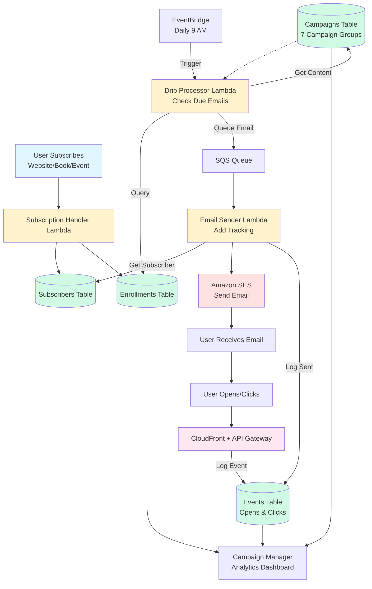

# Email System - Simplified Flow

## Simple Flow Summary

1. **User subscribes** → Subscription Handler creates subscriber + enrollment
2. **Daily trigger** → Drip Processor checks which emails are due
3. **Queue email** → SQS decouples processing from sending
4. **Send email** → Email Sender adds tracking pixels/links and sends via SES
5. **User interacts** → Opens/clicks tracked via CloudFront → logged to Events table
6. **View analytics** → Campaign Manager shows stats from Events + Enrollments

## Key Components

- **3 Lambda Functions**: Subscription Handler, Drip Processor, Email Sender
- **4 DynamoDB Tables**: Subscribers, Enrollments, Campaigns, Events
- **1 SQS Queue**: Decouples drip processing from email sending
- **EventBridge**: Daily trigger at 9 AM UTC
- **CloudFront + API Gateway**: Tracking pipeline for opens/clicks
- **Amazon SES**: Email delivery service

## Campaign Groups (7 emails each)

1. `pre-purchase-book-sequence` - Free survival kit signups
2. `post-purchase-sequence` - Book buyers
3. `election-map-transition-sequence` - Election map users
4. `general-newsletter-sequence` - Website subscribers (includes 2 book promo emails)
